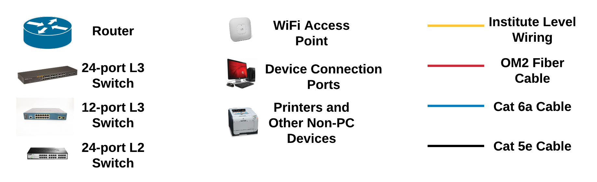

<!-- <h2 >Location</h2> -->
<!-- This project was done as a industrial software internship at Hike Pvt. Ltd., New Delhi, during May ‘17 - Jul ‘17, the summer of my second year. -->
<!-- This project was taken as part of the Robotics club at IIT Kanpur during my first two years at IIT Kanpur. -->

  <!-- Div section taken from the featured image portion of the actual rendered HTML page -->
  
  Legend

<!--  -->

<h2>Details</h2>
<!-- This project was started as part of the course CS657: Information Retrieval, in the Spring ‘18 term at IIT Kanpur under Prof. Arnab Bhattacharya, Department of Computer Science and Engineering, IIT Kanpur. It was later continued beyond the course into my second undergraduate research project. -->

This project was done as part of the course CS425A: Computer Networks, in the Fall ‘18 term at IIT Kanpur under Prof. Dheeraj Sanghi, Department of Computer Science and Engineering, IIT Kanpur.

<!-- This project was done as an undergraduate project, in the Spring ‘18 term at IIT Kanpur under Prof. Indranil Saha, Department of Computer Science and Engineering, IIT Kanpur. -->

<!-- <h2>Brief summary of the work done in the project</h2> -->
<h2>Objective</h2>

The project aims to develop a video conferencing web application. This application should be capable of handling multi-stream video feeds for different users within the network. The web application was hypothetically supposed to be deployed in the Faculty Building at IIT Kanpur which will allow faculty members to attend meetings online via the application.

<h2>Features</h2>
<ol style="text-align: justify;">
  <li> <b>Peer-to-Peer Connection</b>: We use peer-to-peer connection rather than server based relaying of video streams. The host server only sets up the connection between two or more clients. After the connection is setup, exchange of data among the peers does not involve the server.

  <li> <b>Platform Independent</b>: The application doesn’t require the clients to install any software on their personal computer. They just need to login to the hosted website and the server handles setting up the connection and sharing communication protocols.
    
  <li> <b>Multiple Chatrooms</b>: Every conference will be allotted a unique chat room id with which all the users can join the associated chatroom. Since there can be several conferences that might be hosted simultaneously in different rooms, the application allows initiating multiple chatrooms to run independent of the others.
</ol>

<!-- <h3>Attributions:</h3>
<ul>
  <li><a href="https://commons.wikimedia.org/wiki/File:Ada_horizon_green_logo_with_slogan.svg">"Ada programming language logo (2023)"</a> by <a href="https://commons.wikimedia.org/wiki/User:Captain-Haddock17">William J. Franck</a> is licensed under <a href="https://creativecommons.org/publicdomain/zero/1.0/deed.en">CC0 1.0</a> / Merged with other images</li>
</ul> -->